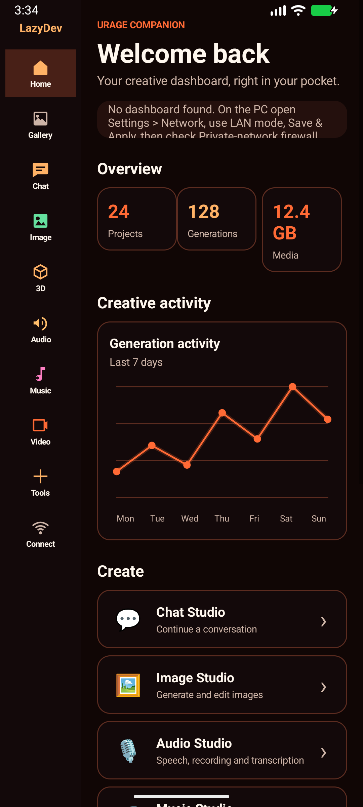
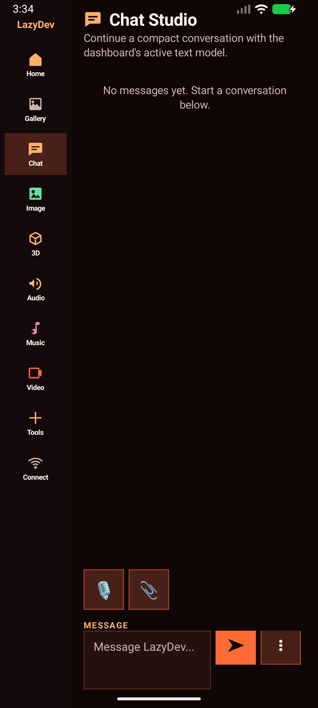
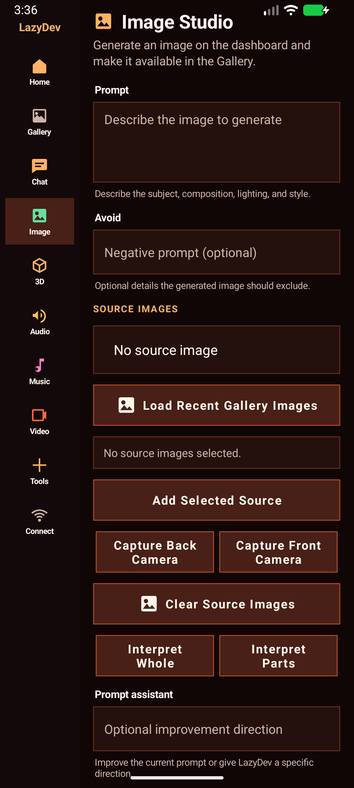
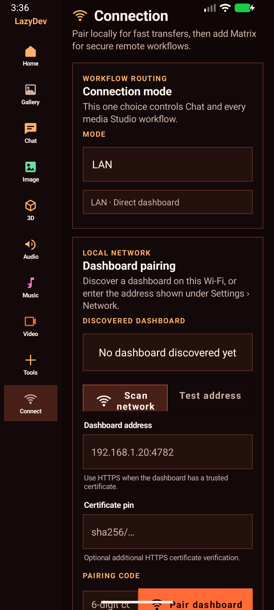

# URage NOW Android Companion

URage NOW Android Companion is the free, open companion app for URage NOW Studio. It discovers exposed dashboards on the local network, pairs from a one-scan camera QR or a one-time fallback code, and transfers generated or uploaded images, videos, audio, and 3D models.

## Screenshots

| Home overview | Chat Studio |
| --- | --- |
|  |  |
| Image Studio | Connection |
|  |  |

## What it includes

- Theme-aware Home overview that follows the paired dashboard's selected theme.
- Chat, Image, 3D, Audio, Music, and Video studios with durable background jobs.
- Encrypted Matrix relay for internet Chat and media workflows, including voice transcription through the dashboard STT workflow.
- Gallery, dashboard-provided tools, QR pairing, scoped permissions, and Android Keystore-backed credentials.

## Dashboard setup

The easiest setup is now entirely in the dashboard:

1. Open **Settings > Network** on the dashboard PC.
2. Select **LAN / Android companion**.
3. Click **Use Recommended**, review the detected Wi-Fi or Ethernet address, then click **Save & Apply**.
4. If the readiness checks are green, open the Android app and tap **Scan network**.
5. Choose **Create Pairing QR**, then either scan it with the phone's camera app or tap **Scan Pairing QR** inside URage Companion. The app exchanges the embedded short-lived opaque credential once. The six-digit code remains available as a manual fallback.

The Dashboard Access Token QR under **Network > Connection** is for browser login and deliberately is not accepted as an Android companion credential. Android devices should use the scoped, revocable, one-use pairing QR under **Network > Devices**.

Completed background generations are shown directly in their owning Image, 3D, Audio, Music, or Video Studio. Result cards load the generated thumbnail when available and open the actual media preview on tap; the Gallery remains the full searchable library. Landscape keeps the persistent LazyDev left rail, while portrait puts the same destinations in a labeled bottom bar.

The settings page persists the configuration in `.env.main.local`, stores generated access tokens in the operating-system credential store, updates the running listener, and shows scoped Windows Private-network firewall commands when needed.

The equivalent manual configuration is:

```env
DASHBOARD_BIND_HOST=0.0.0.0
DASHBOARD_PUBLIC_BASE_URL=http://192.168.1.20:4782
DASHBOARD_EXPOSE_API=true
DASHBOARD_ALLOWED_CLIENTS=192.168.1.0/24
```

Restart the dashboard only when editing the environment file manually. It listens for discovery probes on UDP port `47820`. A fresh code can also be retrieved locally:

```powershell
Invoke-RestMethod http://127.0.0.1:4782/api/companion/pairing-code
```

Do not expose the dashboard or UDP discovery port to the public internet. Pairing codes expire after ten minutes, failed attempts are rate-limited, and successful pairing replaces the one-time code. Device tokens are stored as SHA-256 hashes by the dashboard. Paired devices can be reviewed and revoked from Settings > Network.

## Android build

Open `apps/android-companion` in Android Studio, install Android SDK 35 when prompted, and run the `app` configuration on Android 10 or newer.

The included Gradle wrapper still requires JDK 17 and Android SDK 35. From this directory, compile the Java sources with:

```shell
./gradlew :app:compileDebugJavaWithJavac
```

On Windows, Android Studio's bundled runtime can be selected for a command-line build:

```powershell
$env:JAVA_HOME='C:\Program Files\Android\Android Studio\jbr'
.\gradlew.bat :app:assembleDebug
```

The debug APK is written to `app/build/outputs/apk/debug/app-debug.apk`.

Matrix relay builds include locally packaged Matrix Rust SDK and rustls verifier AARs. Together they initialize and bridge Android's platform TLS verifier before the app creates a Matrix client; keep both AARs with the project when building, rather than replacing only the SDK with the published dependency.

Use that debug APK rather than `app-release-unsigned.apk`: the debug artifact is signed automatically and is directly installable. It requires Android 10 (API 29) or newer. If Android reports that the package is invalid, rebuild with `clean :app:assembleDebug` and verify/install the exact artifact:

```powershell
& "$env:LOCALAPPDATA\Android\Sdk\build-tools\35.0.0\apksigner.bat" verify --verbose .\app\build\outputs\apk\debug\app-debug.apk
adb install -r .\app\build\outputs\apk\debug\app-debug.apk
```

If a build signed with a different key is already installed, Android will reject an update. Remove that older `com.uragestudio.companion` installation from the device before installing this debug build; uninstalling also removes that installation's local pairing state.

## Signed release

The committed version source is `version.properties`. Use the root version command before every distributed build; it increments Android's monotonic `VERSION_CODE` and updates the semantic `VERSION_NAME` together:

```powershell
npm run version:android -- patch       # bug fix: 0.14.3 -> 0.14.4
npm run version:android -- minor       # feature: 0.14.3 -> 0.15.0
npm run version:android -- major       # breaking release: 0.14.3 -> 1.0.0
npm run version:android -- 0.15.0-rc.1 # explicit release candidate
```

`feature` is an alias for `minor`. Add `--dry-run` to preview without editing files. Then build the signed, versioned release from the repository root:

```powershell
npm run build:android-release
```

The first build creates a persistent RSA release key and credentials under `DASHBOARD_DATA_DIR/android-signing`; both are ignored by Git. Back up that directory securely. Losing the key means future versions cannot upgrade existing installations. The versioned APK and SHA-256 manifest are published under `DASHBOARD_DATA_DIR/android-releases`, and the running dashboard serves them at `/android-companion`.

Release minification is intentionally disabled. The encrypted Matrix SDK includes JNA code that resolves Java bridge members from native code by their literal names; R8 changes those names and causes startup crashes. The universal artifact is already primarily native Matrix libraries, so dependable Matrix support is more valuable than the modest code-size reduction.

For a production organization, replace the locally generated key through the `ANDROID_RELEASE_KEYSTORE`, `ANDROID_RELEASE_STORE_PASSWORD`, `ANDROID_RELEASE_KEY_ALIAS`, and `ANDROID_RELEASE_KEY_PASSWORD` environment variables and protect those values with the deployment secret store.

The client uses Android and Java platform APIs only. The paired-device token is encrypted with an Android Keystore AES-GCM key; it is not stored as plaintext preferences.

## Transfers

- Images uploaded from Android are imported into Image Studio history.
- Audio, video, and 3D uploads are stored in `DASHBOARD_DATA_DIR/companion-uploads`.
- Generated dashboard media and companion uploads can be listed and downloaded.
- The Android app opens into separate Gallery and Connection workspaces instead of one long setup form.
- The gallery requests 18 newest items at a time using stable opaque cursors, renders a two-column thumbnail grid, searches the pages already loaded, and exposes an explicit **Load more** action rather than downloading the entire media catalog.
- Image thumbnails are 320×240 JPEG derivatives cached under `DASHBOARD_DATA_DIR/companion-thumbnails`; gallery browsing does not transfer full-resolution originals.
- Tap a gallery card to preview it. Images open full-size, video uses native playback controls, and audio/music opens a decoded waveform, timeline, and player. Long-press for download, uploaded-title editing, or deletion; the dashboard checks the paired device's permissions before every action.
- **Gallery > Settings** can opt into durable offline copies. When enabled, media opened in a preview is retained under app-private storage and remains browsable without the dashboard; disabling the setting stops new durable copies, while **Clear offline media** removes existing copies.
- Downloads run as durable Android JobScheduler jobs, retain partial files in app storage, resume with HTTP Range requests, and publish completed files under `Downloads/URage NOW`.
- Uploads run as durable Android JobScheduler jobs, send validated 1 MiB chunks, resume from the server's acknowledged offset, and complete idempotently.
- Individual uploads are capped at 100 MiB.

Discovery sends both global and Wi-Fi-subnet broadcast probes. Guest Wi-Fi, VPNs, access-point isolation, or some routers may still filter them. Enter the LAN URL shown in Dashboard Settings and tap **Test URL** when that happens. A successful test proves HTTP reachability independently of UDP discovery.

## Mobile Studio workflows

Android Companion uses a shared Material-based mobile design system with compact status surfaces, labeled inputs, clear action hierarchy, readable selectors, and purposeful Gallery empty states. In landscape it uses a persistent **LazyDev** left rail for **Home**, **Gallery**, **Chat**, **Image**, **3D**, **Audio**, **Music**, **Video**, **Tools**, and **Connect**. In portrait those same labeled destinations move to a horizontally scrollable bottom bar, leaving the screen width for studio content. System-bar styling is deferred until Android has created the Activity decor view, fixing the signed-release startup crash seen on Android 16.

The **Tools** workspace loads the paired dashboard's current tool catalog rather than shipping a hardcoded copy. It renders horizontally scrollable category tabs, tool summaries, and the selected tool inside a constrained WebView. Tool HTML, scripts, styles, and media are fetched through the authenticated companion API; WebView file/content access and external navigation are disabled. Enable **Browse Tools** under **Settings > Network > Remote Access**, or grant `tools.browse` only to a selected device. The permission defaults off because server tools can execute JavaScript.

Under **Connect > Studio theme**, Android follows the paired dashboard's persisted Fire, Light, Smoke, Blood, Love, Water, Crystal, Nature, or Rock theme by default. The last synchronized theme is cached for offline startup. Disable **Follow paired dashboard theme** to retain and apply an Android-only override; re-enabling it does not discard that local choice. Palettes control the complete mobile component system, workspace rail, native selectors, Markdown/code presentation, waveform, gallery cards, and system bars. Light uses a real light Material window theme rather than recoloring only the content.

The focused workflow capabilities are:

- Chat persists a bounded conversation on the phone, presents user and LazyDev messages as separate theme-aware Markdown bubbles, streams direct-dashboard replies into the active assistant bubble, and can reconstruct the correlated conversation from the configured Matrix room.
- Image supports negative prompts, seed, steps, CFG, automatic generation-time improvement, explicit **Improve Prompt**, whole-reference and per-part vision interpretation, multiple reference selection, camera capture, and square/landscape/portrait/compact size presets. The first selected reference drives image-to-image generation while every selected reference participates in interpretation.
- 3D is image-first. Its default mode requires a recent Gallery image or a front/back camera capture and does not show or require a text prompt. The optional **Generate source image from text** mode exposes a prompt, saves that generated image, and immediately passes it into image-to-3D generation. Stage-aware errors distinguish source-image failures from model-generation failures, and a generated source remains available in Image Studio if the model stage fails. Optional low-poly generation applies to either mode. Completed GLB results render in an interactive, fully local Three.js viewport with orbit, zoom, animation, camera reset, and a larger tap-through preview.
- Audio generates prompt-driven sound effects and ambience with duration presets.
- Music generates from tags, optional structured lyrics, and a target duration.
- Video exposes prompt, negative prompt, frame size, duration, frame rate, steps, and seed controls, and can use a recent Gallery image as the image-to-video source.
- Every media Studio can save the complete current prompt configuration as a named preset, mark useful presets as favorites, reapply them, and delete them independently of the other Studios.

Phone and tablet orientation changes recreate the activity so the navigation can switch between the bottom bar and left rail. The active workspace is restored; durable jobs and persisted media remain available after rotation.

These capabilities default to disabled. Enable the individual Chat, Image, Audio, Music, Video, and 3D permissions under **Settings > Network > Remote Access**, or grant them only to a selected phone under **Network > Devices**. Prompt-to-3D needs both the Image and 3D permissions because it creates a source image before the model.

For a generated dashboard model, long-press its Gallery card or use **Open in Bambu Studio** in the completed 3D Studio result. This sends a permission-checked request to the paired dashboard host, which launches its configured Bambu Studio under that host's operating-system user. It never attempts to run desktop Bambu Studio on the phone. Enable **Open 3D models in Bambu Studio** in the companion access policy first. This handoff requires the direct LAN/HTTPS dashboard route; Matrix-only results remain portable media but cannot currently launch an application on the host.

Opening a GLB or FBX model from Gallery uses a near-fullscreen viewport so orbit, pinch zoom, and model framing remain usable on phone-sized screens. Other formats use a compact handoff message instead of wasting the screen on an unsupported renderer.

For a generated dashboard model, long-press its Gallery card or use **Open in Bambu Studio** in the completed 3D Studio result. This sends a permission-checked request to the paired dashboard host, which launches its configured Bambu Studio under that host's operating-system user. It never attempts to run desktop Bambu Studio on the phone. Enable **Open 3D models in Bambu Studio** in the companion access policy first. This handoff requires the direct LAN/HTTPS dashboard route; Matrix-only results remain portable media but cannot currently launch an application on the host.

Select one global route under **Connect**: **LAN** uses the paired dashboard directly, while **Internet > Matrix** uses the encrypted relay. That persisted choice steers Chat and every media Studio, including durable background jobs; individual forms no longer carry contradictory backend selectors. Configure Matrix with an HTTPS homeserver, the phone user's access token, the URage bot user ID, and a private room ID. Credentials are encrypted with a separate Android Keystore key. Relay results are correlated with random request IDs and accepted only from the configured bot user.

In Matrix mode, camera captures and locally retained Matrix Gallery images can be used as Image, Video, or 3D sources without LAN access. The durable workflow job sends the source through the Matrix Rust SDK's encrypted `m.image` attachment flow and refuses to upload when the configured room is not E2EE. The bot accepts only one-use source tokens from the same allowlisted sender and room, decrypts and validates PNG/JPEG/WebP/GIF signatures, and caps sources at 20 MiB before forwarding them to the dashboard workflow. Source descriptors expire after 30 minutes. The encrypted source attachment remains visible in the private Matrix room by design; it is not uploaded as an unreferenced plaintext media object.

Chat renders headings, emphasis, lists, links, inline code, and fenced code blocks inside distinct conversation bubbles. A live Markdown preview applies the same presentation while the user is still composing.

Android feature ownership is split by responsibility: `ConnectionWorkspaceController` only composes route selection, LAN pairing, Matrix relay, and theme sections; the sections independently own their state and presentation. `WorkspaceRailController` owns the responsive landscape rail and portrait bottom bar, while `WorkflowJobRailBinder` independently maps persisted job state to destination badges. `ToolsWorkspaceController` owns live catalog categories and authenticated WebView resource delivery. `GalleryWorkspaceController` owns browsing, pagination, transfers, and previews, while `ChatWorkspaceController` owns streaming and conversation persistence. `WorkflowWorkspaceController` is an intentionally small router over focused Image, Audio/Music, Video, and 3D controllers. `MediaStudioSupport` centralizes durable job presentation, source-image loading, and queue selection without duplicating them across forms.

Controller-level Android instrumentation tests cover left-sidebar navigation, direct Studio and Tools access, saved-pairing startup restoration, LAN/Internet route visibility, and theme-follow presentation. Compile them with `.\gradlew.bat :app:compileDebugAndroidTestJavaWithJavac`; execute them on an attached emulator or device with `.\gradlew.bat connectedDebugAndroidTest`.

Use separate Matrix accounts for the phone and bot. The bot ignores its own events by design, so using the bot token in Android cannot run workflows. Matrix Chat streams encrypted, ordered `URAGE_PROGRESS` deltas before the correlated final result; duplicated or out-of-order progress events are ignored.

Matrix networking, timeline decryption, session persistence, and encrypted-media validation use the official Matrix Rust SDK Android bindings. Completed Matrix Image/3D results are decrypted into the app-private Matrix Gallery; images render local previews and any item can be copied to `Downloads/URage NOW`.

The Matrix connection performs one immediate SDK sync before opening its normal long-poll loop. This initializes the local room store deterministically, so sending does not fail simply because a 30-second first long-poll response outlasts the old 20-second room-discovery window.

Image, 3D, Audio, Music, and Video requests are persisted as Android `JobScheduler` work with network constraints. Their rail destinations show live badges for queued, running, and downloading jobs, capped visually at `99+`. The **Background Jobs** view reports queued, running, downloading, completed, failed, and cancelled states. Jobs survive Activity/app restarts, publish progress notifications, and can be cancelled from their Studio workspace. Completed jobs retain their media descriptor, update the owning Studio's latest-result card immediately, open in the rich preview on tap, and invalidate Gallery automatically. Dashboard-backed results remain in the dashboard Gallery; Matrix-backed results are downloaded after generation.

LAN transport is ordinary HTTP by default. Pair only on a trusted network. For HTTPS, terminate TLS in a trusted reverse proxy and set:

```env
DASHBOARD_PUBLIC_BASE_URL=https://studio.example.lan
COMPANION_TLS_CERTIFICATE_SHA256=sha256/BASE64_LEAF_CERTIFICATE_DIGEST
```

Discovery advertises the HTTPS endpoint and optional leaf-certificate pin. Android always requires normal system CA and hostname validation; the pin is an additional check, not a replacement for trusted certificates. The pin can also be entered manually when discovery is unavailable. The release pipeline verifies the final copied APK with Android SDK `apksigner` before publishing its version and checksum metadata. Version 0.9.0 was installed and visually exercised on an Android 16 emulator; pairing and real-network workflow validation still require a physical device on the dashboard network.

Release builds publish ARM64, ARM32, x86_64, universal APKs, and a signed AAB. The dashboard download page recommends ARM64 for modern phones, keeps the universal APK as a compatibility fallback, and exposes the AAB for store delivery.

## Device permissions

Dashboard **Settings > Network > Remote Access** defines defaults for all paired companion devices. Media browse, download, upload, metadata editing, deletion, server-tool browsing, Chat, Image, Audio, Music, Video, and 3D generation are separate capabilities; raw HTTP verbs are shown only as an explanatory mapping. **Network > Devices** can save an override for one paired phone, restore inheritance, or revoke that device entirely. Existing devices preserve media browse/download/upload behavior while metadata editing, deletion, Tools, and Studio workflows start disabled.

The Devices tab can also export/import the versioned policy document and display the append-only access audit. The audit rotates at 5 MiB and records pairing/revocation, policy changes, and allowed or denied capability checks.
